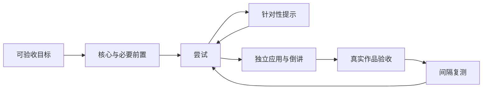

<div align="center">

# Codex Learning Plugin · 学习

**抓住核心，主动练习，用真实成果证明学会。**

[](https://github.com/everclear077/codex-learning-plugin/actions/workflows/ci.yml)
[](LICENSE)
[](https://learn.chatgpt.com/docs/plugins)

中文 · [English](README.en.md) · [安装](#安装) · [使用](#使用) · [贡献](CONTRIBUTING.md)

</div>

把“给我讲讲这个领域”变成一个能执行的学习过程：确定成果、筛选少数核心概念、尝试、获得提示、再试、倒讲、复测，最后交付真实作品。

这是一个社区维护的 **Codex 插件**，包含 `learn-core` 技能与可选 Anki 导出脚本。默认中文，也会跟随学习者的语言。不需要额外 API Key、MCP 服务或后台进程；使用 Codex 自身的模型与可用工具。非 OpenAI 官方项目。

## 一眼了解

| 希望解决的问题 | 插件怎样帮助 |
|---|---|
| 资料太多，不知道先学什么 | 从目标反推5–9个核心概念，明确必要前置与暂缓内容 |
| 听懂了，却做不出来 | 默认一次一题，等你作答；错了先提示，独立应用才通过 |
| 聊了很多，没有成果 | 尽早做首版，结束前按事先约定的标准验收 |
| 当天会，过几天忘 | 续学先闭卷测旧知识，支持Anki卡片导出 |
| AI替我做完，能力没增长 | 分开记录提示完成、独立完成、迁移与延迟复测 |



20小时是可调整的冲刺预算，不是精通保证。可以从30分钟开始；预算、前置与成果规模一起调整。

## 安装

需要支持 `codex plugin` 的 Codex CLI，以及 Git。可用 `codex plugin --help` 检查。命令形状和本地 marketplace 安装以 Codex CLI **0.153.4** 验证；这不是宣称所有旧版本都兼容。

### 从 GitHub 安装

```sh
codex plugin marketplace add everclear077/codex-learning-plugin --ref main
codex plugin add core-learning@codex-learning
```

安装后**新建一个 Codex 任务或 CLI 会话**，选择「学习」或调用 `$learn-core`。发布在GitHub不等于自动进入OpenAI公共插件目录。插件/CLI的能力与可用界面以[官方文档](https://learn.chatgpt.com/docs/plugins)为准。

| 标识 | 值 |
|---|---|
| GitHub仓库 | `codex-learning-plugin` |
| Marketplace | `codex-learning` |
| 插件标识 / 显示名 | `core-learning` / 学习 |
| 技能调用 | `$learn-core` |

### 从本地克隆安装

以下命令在PowerShell、macOS或Linux终端均可使用：

```sh
git clone https://github.com/everclear077/codex-learning-plugin.git
cd codex-learning-plugin
codex plugin marketplace add .
codex plugin add core-learning@codex-learning
```

不要同时注册同名的远程和本地marketplace。切换来源时先检查现有来源；详见[安装、更新与排查](docs/installation.md)。如果只需要技能，可使用该文档中的手动复制方案。

## 使用

### 开始一个领域

```text
用 $learn-core 带我学习 Transformer。我会 Python，预算20小时。
目标：手写 causal attention + MLP，训通字符级小 GPT，讲清 mask 与 √dₖ。
先检查必要前置，再一次一题带我练；答错只给提示，等我回答。
```

### 只有30分钟

```text
用 $learn-core 帮我理解贝叶斯更新。我只会基础概率。
30分钟后，希望我能独立解释并算出一个简单诊断例子。
```

### 继续学习

```text
用 $learn-core 继续 learning/my-topic/progress.md 对应的课程。
先闭卷考我，再根据实际错误决定今天练什么。
```

### 五种模式，分开运行

| 模式 | 适合什么时候 | 可以这样说 |
|---|---|---|
| 苏格拉底练习（默认） | 学新核心、修复卡点 | 一次一题，错了提示，不要直接给答案 |
| 倒讲查漏 | 检查自己是否真懂 | 我来解释，你只抓漏洞，等我修正 |
| 刷题提速 | 基础正确、需要熟练 | 给我5道短题，提交后再统一反馈 |
| 项目毒舌评审 | 已有作品 | 按验收标准严格评审，让我自己修复 |
| 间隔测验 | 每次续学开始 | 先考上次和更早学过的知识，别先提示 |

每轮只有一种活动模式，切换时明确说明。必要的短解释和不同例子可以提供支架；不会让新手无限猜。你也可以明确要求直接讲解或完整答案，之后用新题重新检查独立能力。

## 进度、卡片与隐私

持续课程可在当前工作区的 `learning/<topic-id>/` 保存进度、错因、提示情况、作品和来源；短问答不强制建文件。进度不写入插件安装缓存。本仓库默认忽略真实学习记录。

Anki导出脚本只依赖 **Python 3.10+ 标准库**。克隆仓库后，可先导出随附的合成示例：

```sh
python plugins/core-learning/skills/learn-core/scripts/export_anki.py examples/cards.json cards.tsv
```

导入Anki时映射Front、Back、Tags，核对预览后导入。重复检查以正面为准；改动正面可能新增卡片。**导出文件不等于已导入；FSRS排程由Anki完成，插件不自带排程器或后台提醒。** [完整指南](plugins/core-learning/skills/learn-core/references/spaced-recall.md)

插件没有自建遥测或上传服务，但对话内容及代理调用的工具仍受Codex/模型提供商与所访问服务的数据政策约束。详见[隐私说明](PRIVACY.md)。

## 理论依据与边界

融合20-Hour AI Tutor Protocol、Feynman倒讲、主动回忆、间隔练习、掌握学习、样例学习、交错练习与逆向设计，并参考learn-anything-24h、Superlearn、mastery-loop的工程做法。逐项说明原始出处、采用内容与不采用的冲突规则。

- [方法调研与溯源](plugins/core-learning/skills/learn-core/references/方法梳理与溯源.md)
- [五种模式的严格边界](plugins/core-learning/skills/learn-core/references/modes.md)
- [课程设计与验收](plugins/core-learning/skills/learn-core/references/teaching.md)
- [第三方来源与许可范围](THIRD_PARTY_NOTICES.md)

本项目未进行学习效果随机对照试验。通过代码测试不等于证明学习提速；AI评分也需核查，作品成功与学习者独立掌握分别记录。

## 仓库结构

```text
.agents/plugins/marketplace.json    # 可分发marketplace入口
plugins/core-learning/              # 独立、可打包的插件
  .codex-plugin/plugin.json         # 插件元数据
  skills/learn-core/
    SKILL.md                       # 家教入口与不变量
    agents/openai.yaml             # Codex技能展示元数据
    references/                    # 模式、进度、理论、间隔回忆
    scripts/export_anki.py          # 本地卡片导出
docs/                              # 安装、架构、行为验收、发布流程
examples/                          # 合成示例，无真实学习记录
scripts/                           # 校验、敏感信息检查、插件打包
tests/                             # 导出与仓库工具测试
AGENTS.md / CLAUDE.md               # AI辅助开发约定
```

## 开发与验证

```sh
python -m pip install -r requirements-dev.txt
python scripts/validate_repo.py
python -m unittest discover -s tests -v
python scripts/scan_public.py
python scripts/package_plugin.py
```

开发依赖只有固定版本PyYAML；正常家教不依赖Python，导出不需要PyYAML。CI在Windows/Linux、Python 3.10/3.14检查结构、链接、导出行为与发布内容。压缩包仅包含插件目录中的发布文件与许可证，不包含`.git`、本机配置、学习记录或测试缓存。

提示词行为另用[交互验收场景](docs/behavior-evals.md)人工检查，不用匹配几句文本来冒充模型行为测试。[开发约定](AGENTS.md) · [贡献指南](CONTRIBUTING.md) · [发布流程](docs/releasing.md)

## 许可

[MIT](LICENSE)。欢迎修改、贡献与分发。引用的研究和外部项目仍适用各自许可；引用链接不意味着捆绑它们的代码或获得官方背书。
